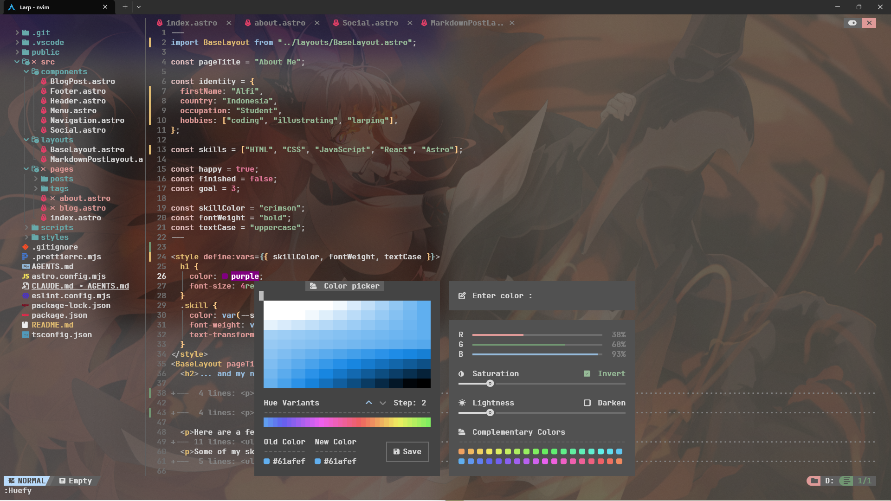

# My Personal Neovim Configuration

A beginner personal Neovim configuration built on top of [NvChad](https://github.com/NvChad/NvChad) plugin, currently tailored for modern web development (Astro, TypeScript, HTML/CSS)

Terminal background art: <a href="https://www.pixiv.net/en/artworks/88654856">"42" (Pixiv Artwork)</a> by <a href="https://pixiv.net">Ruilur</a>

---

# Prerequisites

> [!NOTE]
> This configuration is currently set up and tested exclusively on **Windows 11**.
> You do **not** need to pre-install NvChad; `lazy.nvim` automatically bootstraps NvChad as a plugin on first launch.

Before using this config, make sure you have the following installed on your system:
- **Neovim** (v0.12.4 tested): [Installation Guide](https://neovim.io/doc/install/)
- **Git**: [Installation Guide](https://git-scm.com/install/)
- **A Nerd Font** (e.g., JetBrainsMono Nerd Font): [Font Downloads](https://www.nerdfonts.com/font-downloads) *(set this as your terminal font)*
- **ripgrep** (for Telescope file search & live grep): [Installation Guide](https://github.com/burntsushi/ripgrep#installation)
- **Node.js & npm** (required for Prettier and web language servers):
  - [Node.js Official Installer](https://nodejs.org/), or
  - [nvm-windows](https://github.com/coreybutler/nvm-windows) *(Node Version Manager for Windows)*
- **win32yank** (required for Windows clipboard synchronization):
  - [win32yank Repository](https://github.com/equalsraf/win32yank) (or via winget: `winget install equalsraf.win32yank`)

---

# Plugins Overview

This setup relies on the official **NvChad & NvZone ecosystem**, customized with personal configurations:

## Configured Modules
- **Formatting ([`conform.nvim`](https://github.com/stevearc/conform.nvim)):** Format-on-save using `prettier` (Astro, TS, JS, CSS, HTML) and `stylua` (Lua).
- **LSP ([`nvim-lspconfig`](https://github.com/neovim/nvim-lspconfig) + [`mason.nvim`](https://github.com/williamboman/mason.nvim)):** Pre-configured servers for Astro, TypeScript (`ts_ls`), ESLint, HTML, CSS, and Lua.
- **Color Tools ([`nvzone/minty`](https://github.com/nvzone/minty)):** Interactive color picker and shade generator UI.
- **Autocompletions ([`nvim-cmp`](https://github.com/hrsh7th/nvim-cmp)):** Extended with Windows-friendly completion keybinds (`<C-o>`, `<C-Space>`).
- **Syntax & Folding ([`nvim-treesitter`](https://github.com/nvim-treesitter/nvim-treesitter)):** Web parsers installed with Treesitter-based expression folding (`foldlevel = 99`).
- **Markdown Preview ([`render-markdown`](https://github.com/MeanderingProgrammer/render-markdown.nvim)):** Still uses the default configuration.

## Core NvChad Suite
- **File Explorer:** `nvim-tree.lua`
- **Fuzzy Finder:** `telescope.nvim`
- **UI & Theming:** `base46` (theme engine with transparency), `ui` (statusline & tabs), `which-key.nvim`, `indent-blankline.nvim`
- **Git Integration:** `gitsigns.nvim`

---

# Configured Language Servers (LSP)

Managed via Mason and configured in `lua/configs/lspconfig.lua`:
- `astro` (includes Astro auto-import preferences)
- `ts_ls` (TypeScript & JavaScript)
- `eslint` (Linting diagnostics)
- `html` & `cssls`
- `lua_ls` (Neovim runtime & NvChad types)
- `tailwindcss`

---

# Useful Commands & Keymaps

## Key Notation Legend

- `<leader>` = `Space`
- `<C>` = `Ctrl`
- `<M>` = `Alt`

## Guidance & Diagnostics

- `:NvCheatsheet` (or `<leader>ch`) Opens the interactive on-screen cheatsheet for all NvChad keybinds.
- `g?` Inside the `NvimTree` window, shows all file explorer shortcuts.
- `<Leader-wK>` Activate which-key (all keymaps) popup menu.
- `:checkhealth` Run health checks for LSP, Treesitter, Lazy, and clipboard tools.

## Additional Keymaps/Commands
| Key / Command | Mode | What it does |
|---|---|---|
| `<C-o>` or `<C-Space>` | Insert | Manually trigger autocomplete suggestions (`cmp`) |
| `jk` | Insert | Quick escape to Normal mode |
| `:Shades` | Command | Open Minty shade picker |
| `:Huefy` | Command | Open Minty hue/color picker |

# Credits

- [ProgrammingRainbow/NvChad-2.5](https://github.com/ProgrammingRainbow/NvChad-2.5) for the setup guide and tutorial that helped structure this configuration.
- [NvChad](https://github.com/NvChad/NvChad) for the fast, beautiful Neovim base and UI ecosystem.
- [Lazyvim starter](https://github.com/LazyVim/starter) as nvchad's starter was inspired by Lazyvim's . It made a lot of things easier! (From NvChad)
